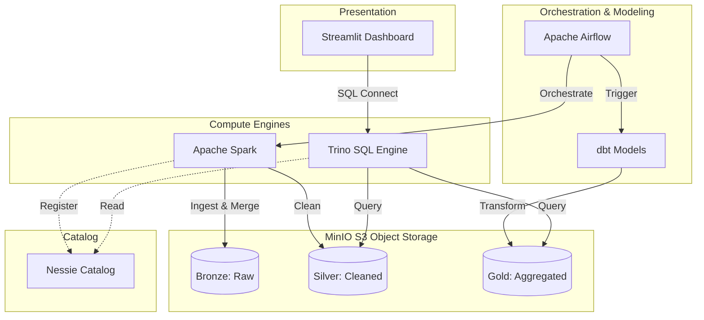

<div align="center">


[](https://git.io/typing-svg)

**A recruiter-focused data engineering project demonstrating an open lakehouse with Apache Iceberg, Spark, Nessie, MinIO, and Trino.**


</div>

---

## 🌊 Why This Lakehouse?

Modern data engineering requires scalable, reliable, and multi-engine compatible storage. This project implements a **Bronze ➔ Silver ➔ Gold** medallion architecture on S3-compatible object storage using **Apache Iceberg**, allowing you to treat your data lake like a traditional ACID database.

See the deep dives in [PROJECT_SHOWCASE.md](PROJECT_SHOWCASE.md) and [docs/architecture.md](docs/architecture.md).

---

## ✨ Enterprise Capabilities

| 🏗️ Architecture & Storage | 🔄 Processing & Analytics | 🛡️ Governance & Quality |
|:---|:---|:---|
| 🥇 Bronze, Silver, Gold Medallion Layers | ⚡ PySpark Batch & CDC `MERGE` pipelines | ⏳ Time-travel & Snapshot history |
| 🪣 S3-Compatible MinIO Object Storage | 📈 Trino distributed SQL query engine | 🔄 Schema Evolution & Hidden Partitioning |
| 🧊 ACID Transactions via Apache Iceberg | 🛠️ dbt analytics models & transformations | 🏥 Data quality quarantine tables |
| 🗂️ Nessie Catalog for Git-like branches | 📊 Streamlit live dashboard | 🧹 Compaction & snapshot maintenance |

---

## 🏗️ Architecture Diagram



---

## 🛠️ Quick Start

<details>
<summary><b>1. Environment Setup</b></summary>

You'll need Docker Desktop, Python 3.11+, and PowerShell (if on Windows).

```powershell
cd iceberg-lakehouse-platform
python -m venv .venv
.\.venv\Scripts\Activate.ps1
pip install -r requirements.txt
pip install dbt-trino==1.8.4
Copy-Item .env.example .env
```
</details>

<details>
<summary><b>2. Start the Stack</b></summary>

Boot up MinIO, Nessie, Spark, Airflow, Trino, and Streamlit using Docker Compose:

```powershell
.\scripts\start_full.ps1
```

**Services:**
- **MinIO console:** `http://localhost:9001`
- **Nessie API:** `http://localhost:19120/api/v2/config`
- **Airflow UI:** `http://localhost:8082` (admin / admin)
- **Trino UI:** `http://localhost:8080`
- **Streamlit Dashboard:** `http://localhost:8501`
</details>

<details>
<summary><b>3. Run the Pipelines</b></summary>

You can trigger the pipeline manually via the Airflow UI (`lakehouse_pipeline` DAG) or via PowerShell:

```powershell
# Ingest 5,000 raw orders into Bronze & Silver via PySpark
.\scripts\run_pipeline.ps1

# Run dbt models to build analytics tables in the Gold layer
.\scripts\run_dbt.ps1

# Run an incremental CDC batch (Iceberg MERGE)
.\scripts\run_incremental.ps1

# Run Iceberg schema evolution & time-travel demos
.\scripts\run_demos.ps1
```
</details>

---

## 🧪 Testing & Teardown

```powershell
# Run unit tests
pytest -q

# Spin down all Docker services
.\scripts\stop.ps1
# or: docker compose -f docker/docker-compose.yml down
```

---

## 🚀 Next Steps for Production

- **Streaming:** Replace generated files with Kafka or Debezium CDC for real-time streaming ingestion.
- **Cloud Storage:** Swap MinIO for AWS S3, Azure Data Lake Storage, or Google Cloud Storage.
- **Lineage:** Integrate OpenLineage and Marquez for end-to-end pipeline visibility.

<div align="center">
  <i>Built by Manik Tomar</i>
</div>
