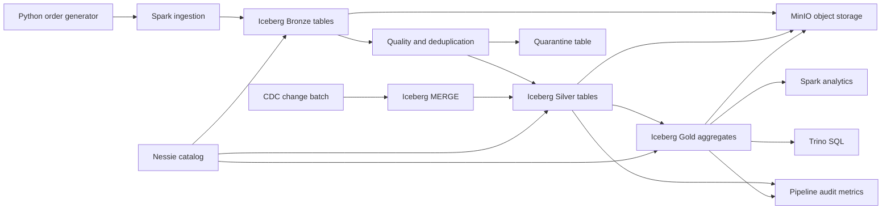

# Architecture

## High-Level Data Flow



---

## Layer Descriptions

### Bronze — Raw Ingestion
Raw JSON events land here unchanged (append-only). Each ingestion run appends
to `orders_raw`, partitioned by ingestion day. Duplicates are not removed at
this layer — the full event history is preserved for reprocessing.

### Silver — Curated Records
Bronze rows are parsed, deduplicated on `event_id`, and validated. Valid rows
go to `orders`; rows failing any quality rule go to `orders_quarantine`.
Silver is partitioned by event month. Incremental CDC batches apply
`MERGE` upserts so inserts, updates, and deletes are reflected without a full
rewrite.

### Gold — Business Aggregates
`daily_sales` aggregates completed orders by `(order_date, category,
sales_channel, currency)`. It is refreshed every pipeline run using
`overwritePartitions`, replacing only the affected date partitions while
adding a new Iceberg snapshot.

### Monitoring
`pipeline_runs` stores one audit row per pipeline execution with row counts
for each layer and the run status.

---

## Table Schemas

### `lakehouse.bronze.orders_raw`

| Column | Type | Notes |
|--------|------|-------|
| `event_id` | STRING | UUID from source |
| `event_time` | STRING | ISO-8601 timestamp string |
| `order_id` | STRING | Business order key |
| `customer_id` | STRING | |
| `customer_email` | STRING | |
| `product_id` | STRING | e.g. SKU-1001 |
| `category` | STRING | electronics / home / sports / fashion / beauty |
| `quantity` | LONG | |
| `unit_price` | DOUBLE | |
| `order_amount` | DOUBLE | quantity × unit_price |
| `currency` | STRING | USD / GBP / EUR |
| `sales_channel` | STRING | web / mobile / store / partner |
| `country` | STRING | ISO-2 country code |
| `status` | STRING | completed / cancelled / refunded |
| `ingested_at` | TIMESTAMP | Spark ingestion time |
| **Partition** | DAYS(`ingested_at`) | Hidden partition |

---

### `lakehouse.silver.orders`

Inherits all bronze columns plus:

| Column | Type | Notes |
|--------|------|-------|
| `event_timestamp` | TIMESTAMP | Parsed from `event_time` |
| `ingested_at` | TIMESTAMP | Overwritten by quality job |
| `computed_amount` | DOUBLE | `ROUND(quantity * unit_price, 2)` |
| `quality_status` | STRING | valid / invalid |
| `loyalty_tier` | STRING | Added by schema evolution demo |
| **Partition** | MONTHS(`event_timestamp`) | Hidden partition |

---

### `lakehouse.silver.orders_quarantine`

Same columns as `silver.orders`. Contains rows that failed any quality rule:
- `event_id` or `order_id` is NULL
- `quantity <= 0` or `unit_price <= 0`
- `|order_amount − computed_amount| > 0.05`

---

### `lakehouse.gold.daily_sales`

| Column | Type | Notes |
|--------|------|-------|
| `order_date` | DATE | Aggregate date |
| `category` | STRING | |
| `sales_channel` | STRING | |
| `currency` | STRING | |
| `order_count` | LONG | Distinct orders |
| `gross_sales` | DOUBLE | Sum of order_amount |
| `avg_order_value` | DOUBLE | Average order_amount |
| `unique_customers` | LONG | Distinct customer_ids |
| **Partition** | `order_date` | |

---

### `lakehouse.monitoring.pipeline_runs`

| Column | Type | Notes |
|--------|------|-------|
| `run_at` | TIMESTAMP | Pipeline execution time |
| `bronze_rows` | LONG | Row count in bronze |
| `silver_rows` | LONG | Row count in silver.orders |
| `quarantined_rows` | LONG | Row count in quarantine |
| `gold_rows` | LONG | Row count in gold |
| `run_status` | STRING | success / failed |

---

## Apache Iceberg Feature Map

| Feature | Where it is demonstrated |
|---------|--------------------------|
| ACID table transactions | Every `writeTo` / `MERGE` call |
| Hidden partitioning | Bronze (DAYS), Silver (MONTHS), Gold (DATE) |
| Schema evolution | `schema_evolution_demo.py` — adds `loyalty_tier` |
| Snapshot history | Every pipeline run creates a new snapshot |
| Time travel | `time_travel_demo.py` queries prior snapshot by ID |
| Data compaction | `maintenance.py` — `rewrite_data_files` |
| Snapshot expiry | `maintenance.py` — `expire_snapshots(retain_last=3)` |
| CDC upserts (MERGE) | `incremental_upsert.py` — INSERT / UPDATE / DELETE |
| Multi-engine access | Spark writes; Trino reads the same tables |
| Nessie versioned catalog | All catalog operations via Nessie REST API |

---

## Design Decisions

- **MinIO** emulates S3-compatible object storage locally; swappable with AWS
  S3, Azure ADLS, or GCS without code changes.
- **Nessie** provides a Git-like versioned catalog — branches, commits, and
  tags on top of Iceberg metadata.
- **Spark** handles ingestion, quality processing, schema evolution, MERGE
  upserts, and maintenance stored procedures.
- **`overwritePartitions`** is used instead of `createOrReplace` in
  `build_silver_gold.py` so every pipeline run produces a new Iceberg snapshot
  (enabling the time-travel demo) rather than resetting history.
- **Bronze is append-only**; Silver and Gold use partition-level overwrite so
  they can be re-run idempotently.
- **Trino** proves that a second query engine can safely read Iceberg tables
  registered in Nessie without any data copying.
- **Audit rows** record layer counts per run for lightweight operational
  monitoring without an external observability tool.

---

## Operational Runbook

### Start the stack
```powershell
.\scripts\start.ps1
```
Wait ~30 seconds for all services to be healthy before running jobs.

### Run the initial pipeline
```powershell
.\scripts\run_pipeline.ps1
```

### Apply an incremental CDC batch
```powershell
.\scripts\run_incremental.ps1
```

### Run Iceberg feature demos
```powershell
.\scripts\run_demos.ps1
```

### Run table maintenance
```powershell
.\scripts\run_maintenance.ps1
```

### Query with Trino
Open `http://localhost:8080`, connect with user `trino` (no password), and
run queries from `sql/trino_analytics.sql`.

### Stop the stack
```powershell
.\scripts\stop.ps1
```

### Troubleshooting

| Symptom | Likely Cause | Fix |
|---------|-------------|-----|
| `minio-init` exits non-zero | MinIO not ready | Re-run `docker compose up -d` |
| Spark job fails with `No such file` | `data/generated/` not created | Run `generate_orders.py` first |
| Trino query returns no rows | Pipeline not run yet | Run `run_pipeline.ps1` |
| `expire_snapshots` errors | Too few snapshots to retain | Run pipeline at least 3× first |
| `MERGE` fails on missing column | Schema not evolved yet | Run `run_demos.ps1` first |
